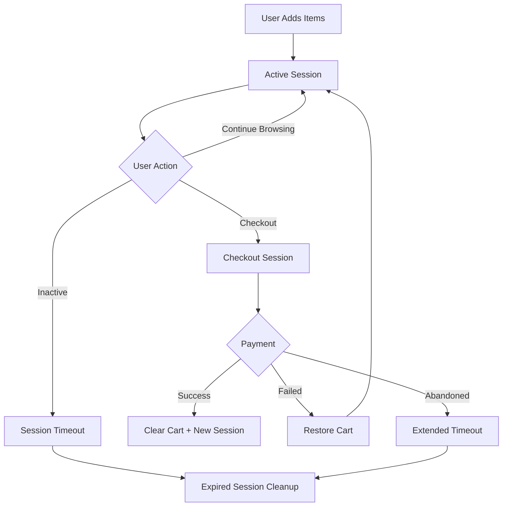

# Session-Based Cart Persistence Strategy

## Current State Analysis

### Current Issues
1. **Persistent Cart Problem**: Cart uses `atomWithStorage` with localStorage, persisting indefinitely even after successful payments
2. **No Session Boundaries**: Cart doesn't differentiate between browsing sessions and completed transactions
3. **Missing Cleanup Triggers**: Cart only clears on manual actions, not on payment completion
4. **Cross-Tab Issues**: Multiple tabs can have inconsistent cart states

### Current Clear Cart Triggers
- **Manual Clear**: User clicks "Clear Cart" button in ShoppingCart/CartDrawer components
- **Post-Order Creation**: Called in CheckoutForm/EnhancedCheckoutForm after order creation (but payment may still be pending)
- **No Payment Success Clearing**: Missing from PaymentSuccessClient workflow

## Proposed Solution Architecture

### 1. Session-Aware Cart State

```typescript
interface CartSession {
  id: string;                    // Unique session identifier
  createdAt: Date;              // Session creation timestamp  
  lastActivity: Date;           // Last user activity timestamp
  expiresAt: Date;              // Session expiration time
  status: 'active' | 'checkout' | 'completed' | 'expired';
  orderId?: string;             // Associated order ID (if in checkout)
  paymentStatus?: 'pending' | 'completed' | 'failed';
}

interface CartState {
  items: CartItem[];
  session: CartSession;
  version: number;              // For cross-tab synchronization
  metadata: {
    userAgent: string;
    tabId: string;
  };
}
```

### 2. Smart Persistence Strategy

#### **Persistence Rules**
- **Active Browsing**: Full persistence with 24-48 hour expiration
- **During Checkout**: Extended persistence until payment completion  
- **Payment Pending**: Maintain cart until payment confirmed/failed
- **Payment Success**: Immediate cart clearing with session reset
- **Payment Failed**: Restore cart with warning notification
- **Session Timeout**: Gradual cleanup of expired sessions

#### **Session Lifecycle**


### 3. Cross-Tab Synchronization

#### **Sync Strategy**
- **Storage Events**: Listen for localStorage changes across tabs
- **Heartbeat System**: Regular sync checks (every 30 seconds)  
- **Conflict Resolution**: Last-write-wins with version numbers
- **Tab Coordination**: Designate "master" tab for cleanup operations

#### **Implementation**
```typescript
// Cross-tab synchronization atom
const cartSyncAtom = atom({
  lastSync: Date.now(),
  tabId: crypto.randomUUID(),
  isMasterTab: false,
  conflicts: []
});
```

### 4. Payment Integration Points

#### **Trigger Points for Cart Clearing**
1. **PaymentSuccessClient**: Primary clearing trigger
2. **Order Status Webhook**: Backend confirmation
3. **Payment Gateway Callback**: Direct gateway confirmation
4. **User Return from Gateway**: URL parameter detection

#### **Payment Status Tracking**
```typescript
interface PaymentTracker {
  orderId: string;
  paymentReference: string;
  gateway: 'flutterwave' | 'paystack' | 'opay';
  status: 'pending' | 'completed' | 'failed' | 'cancelled';
  completedAt?: Date;
  cartSessionId: string;
}
```

### 5. Expiration & Cleanup Logic

#### **Expiration Policies**
- **Active Browsing**: 48 hours of inactivity
- **Checkout Session**: 2 hours for payment completion
- **Payment Pending**: 30 minutes after leaving payment gateway
- **Abandoned Cart**: 7 days for potential recovery

#### **Cleanup Triggers**
- **Page Load**: Check and cleanup expired sessions
- **User Activity**: Extend current session
- **Background Timer**: Periodic cleanup (every 15 minutes)
- **Storage Full**: Emergency cleanup of oldest sessions

## Implementation Plan

### Phase 1: Core Session Management
1. Create session management atoms and utilities
2. Modify cart storage to include session context
3. Implement session lifecycle management

### Phase 2: Payment Integration
1. Add payment completion detection
2. Modify PaymentSuccessClient to clear cart
3. Implement order-cart correlation tracking

### Phase 3: Cross-Tab & Cleanup
1. Add cross-tab synchronization
2. Implement expiration and cleanup logic
3. Add user activity tracking

### Phase 4: Monitoring & Analytics
1. Add cart operation audit trail
2. Implement cart analytics and metrics
3. Add debugging and troubleshooting tools

## Benefits

### **User Experience**
- ✅ Cart persists during normal browsing
- ✅ Automatic clearing after successful payments
- ✅ Consistent state across browser tabs
- ✅ Recovery from interrupted checkout flows

### **Business Value**
- ✅ Reduced cart abandonment confusion
- ✅ Better analytics and tracking
- ✅ Improved conversion rates
- ✅ Enhanced customer support capabilities

### **Technical Benefits**
- ✅ Predictable cart lifecycle management
- ✅ Better performance through cleanup
- ✅ Reduced localStorage bloat
- ✅ Improved debugging capabilities

## Migration Strategy

### **Backward Compatibility**
1. Detect existing cart format and migrate
2. Gradual rollout with feature flags
3. Fallback to current behavior if issues arise

### **Data Migration**
```typescript
function migrateCartData(existingCart: CartItem[]) {
  return {
    items: existingCart,
    session: {
      id: crypto.randomUUID(),
      createdAt: new Date(),
      lastActivity: new Date(),
      expiresAt: new Date(Date.now() + 48 * 60 * 60 * 1000), // 48 hours
      status: 'active' as const
    },
    version: 1,
    metadata: {
      userAgent: navigator.userAgent,
      tabId: crypto.randomUUID()
    }
  };
}
```

## Success Metrics

- **Cart Persistence Rate**: % of users who retain cart items between sessions
- **Post-Payment Cart Clear Rate**: % of successful payments that properly clear cart
- **Cross-Tab Consistency**: % of tab switches with consistent cart state
- **Session Recovery Rate**: % of interrupted checkouts successfully restored
- **Storage Performance**: localStorage usage and cleanup effectiveness
