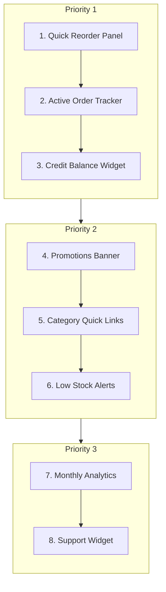
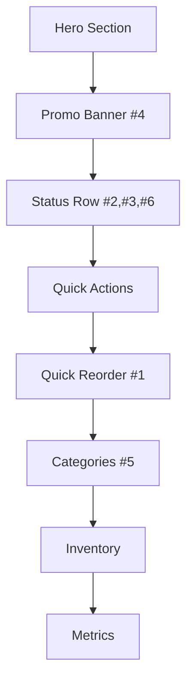

# BenPharm Dashboard Enhancement Plan

This document outlines the prioritized feature implementation plan for the Customer Dashboard.

---

## Implementation Order

---

## Dashboard Layout

---

## Task Checklist (By Priority)

### 🔴 Priority 1: Essential

- [x] **#1 Quick Reorder Panel**
  - [x] Fetch user's purchase history API
  - [x] Design reorder card component
  - [ ] Add quantity selector
  - [x] Implement one-click reorder action
  - [x] Connect to cart API

- [x] **#2 Active Order Tracker**
  - [x] Create order status component
  - [x] Fetch latest active order
  - [x] Add progress stepper UI
  - [x] Display ETA and tracking info
  - [x] Link to full order details

- [ ] **#3 Credit Balance Widget**
  - [ ] Fetch customer credit data
  - [x] Design balance card with progress bar
  - [x] Show credit limit vs used
  - [x] Add "View Statement" link
  - [x] Add "Pay Now" button

---

### 🟣 Priority 2: High Value

- [ ] **#4 Promotions Banner**
  - [x] Design carousel component
  - [x] Create promo data structure
  - [x] Add auto-rotation
  - [ ] Link to promo products
  - [ ] Add countdown timer for urgency

- [x] **#5 Category Quick Links**
  - [x] Define main categories list
  - [x] Design icon grid component
  - [x] Add hover animations
  - [x] Link to filtered catalog

- [ ] **#6 Low Stock Alerts**
  - [x] Calculate reorder suggestions from history
  - [x] Design alert notification card
  - [ ] Add "Reorder All" action
  - [x] Show days since last purchase

---

### ⚪ Priority 3: Nice-to-Have

- [ ] **#7 Monthly Analytics**
  - [ ] Fetch monthly spending data
  - [ ] Add simple chart component
  - [ ] Show top purchased items

- [ ] **#8 Support Widget**
  - [ ] Add floating chat button
  - [ ] Integrate WhatsApp link
  - [ ] Add sales rep contact info
