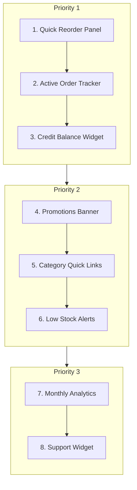
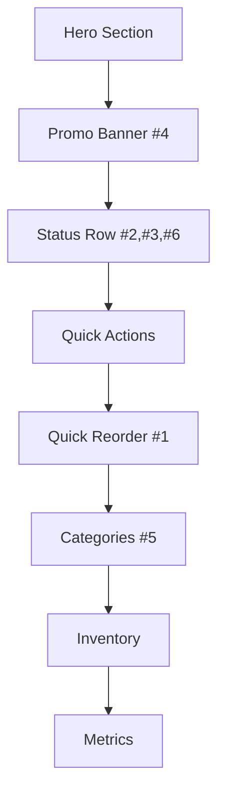

# BenPharm Dashboard Enhancement Plan

This document outlines the prioritized feature implementation plan for the Customer Dashboard.

---

## Implementation Order

---

## Dashboard Layout

---

## Task Checklist (By Priority)

### 🔴 Priority 1: Essential

- [ ] **#1 Quick Reorder Panel**
  - [ ] Fetch user's purchase history API
  - [ ] Design reorder card component
  - [ ] Add quantity selector
  - [ ] Implement one-click reorder action
  - [ ] Connect to cart API

- [ ] **#2 Active Order Tracker**
  - [ ] Create order status component
  - [ ] Fetch latest active order
  - [ ] Add progress stepper UI
  - [ ] Display ETA and tracking info
  - [ ] Link to full order details

- [ ] **#3 Credit Balance Widget**
  - [ ] Fetch customer credit data
  - [ ] Design balance card with progress bar
  - [ ] Show credit limit vs used
  - [ ] Add "View Statement" link
  - [ ] Add "Pay Now" button

---

### 🟣 Priority 2: High Value

- [ ] **#4 Promotions Banner**
  - [ ] Design carousel component
  - [ ] Create promo data structure
  - [ ] Add auto-rotation
  - [ ] Link to promo products
  - [ ] Add countdown timer for urgency

- [ ] **#5 Category Quick Links**
  - [ ] Define main categories list
  - [ ] Design icon grid component
  - [ ] Add hover animations
  - [ ] Link to filtered catalog

- [ ] **#6 Low Stock Alerts**
  - [ ] Calculate reorder suggestions from history
  - [ ] Design alert notification card
  - [ ] Add "Reorder All" action
  - [ ] Show days since last purchase

---

### ⚪ Priority 3: Nice-to-Have

- [ ] **#7 Monthly Analytics**
  - [ ] Fetch monthly spending data
  - [ ] Add simple chart component
  - [ ] Show top purchased items

- [ ] **#8 Support Widget**
  - [ ] Add floating chat button
  - [ ] Integrate WhatsApp link
  - [ ] Add sales rep contact info
